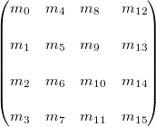

# Assignment 7

## Boilerplate Code
* Fork a new [SDL2 Boiler plate](https://github.com/rroa/SDL2_OpenGL_BoilerPlate) project. (Only one repo per group)
  * Create a new **development** branch and make it the repository default branch.
  * Add your partner to as a collaborator.
  * For this project we will follow the [nvie branching strategy](http://nvie.com/posts/a-successful-git-branching-model/).

## Code Style
* Name your header files using the `.hpp` extension.
* Name your source files using the `.cpp` extension.
* Completely avoid abbreviations.
* Use `#pragma` and `#ifndef` in combination rather than a single one.
* Use the BOOST style guide as your default coding style:

        #include <then_standard_headers>
        #include <in_alphabetical_order>

        #include "then/any/detail/headers"
        #include "in/alphabetical/order"
        #include "then/any/remaining/headers/in"
        // (you'll never guess)
        #include "alphabetical/order/duh"

        #define NAMESPACE_NAMES_THEN_MACRO_NAME(pMacroNames) ARE_ALL_CAPS

        namespace lowercase_identifers
        {
            class separated_by_underscores
            {
            public:
                void because_underscores_are() const
                {
                    volatile int mostLikeSpaces = 0; // but local names are condensed

                    while (!mostLikeSpaces)
                        single_statements(); // don't need braces

                    for (size_t i = 0; i < 100; ++i)
                    {
                        but_multiple(i);
                        statements_do();
                    }             
                }

                const complex_type& value() const
                {
                    return mValue; // no conflict with value here
                }

                void value(const complex_type& pValue)
                {
                    mValue = pValue ; // or here
                }

            protected:
                // the more public it is, the more important it is,
                // so order: public on top, then protected then private

                template <typename Template, typename Parameters>
                void are_upper_camel_case()
                {
                    // gman was here                
                }

            private:
                complex_type mValue;
            };
        }

        #endif

## Math
Move your math library from the old project to this project. You should include the following: `Vector2`, `Vector3`, `Vector4` & `MathUtils`.

Update the code to match the new enforced style guide.

## Matrix4

Read about [affine transformations](http://mathworld.wolfram.com/AffineTransformation.html) and define a complex type to hold a 4x4 matrix.

Column major matrix.

The `Matrix4` type must have 3 constructors to instantiate a Matrix4 class object. All of the matrix elements must be of type `float`. Be wise when choosing the data structure to hold these values.

`Matrix4` type must use the column-major order notation same as OpenGL uses.

The default constructor (no argument), the created `Matrix4` object must be an identity matrix. The other 2 constructors take either 16 arguments or an array of 16 elements. You may also use the copy constructor and assignment operator (=) to initialize a `Matrix4` object.

## Matrix4 Features
* Your type should have accesors for rows and columns.
* Your type should have a setter called `identity`, which does the obvious.
* Your type should have a `get()` which should return a pointer to the member holding the values.
* Your type should have a `getTranspose()` getter which return the transposed matrix elements.
* You should be able to access individual elements by using the **[]** operator. This assumes your values are stored in a sequence.
* You should be able to get individual elements by using the indexes of rows and columns.
* Your type should define a function called `getAngle` which returns 3 Euclidean angles; *pitch*, *yaw*, and *roll* in degree range between -180 ~ +180 from the current matrix.
  * Pitch: Rotation about X-axis
  * Yaw: Rotation about Y-axis
  * Roll: Rotation about Z-axis
* `getAngle()` function assumes the order of rotations is Roll ➔ Yaw ➔ Pitch. If roll is Z, yaw is Y and pitch is X angle. Use the appropriate complex type to return these values.
* Your type must provide a handy print function with `std::ostream` operator *<<*, for debugging purpose.
* Your `Matrix4` type must provide basic arithmetic (+, -, *, /) between 2 matrices.
* Your `Matrix4` should implement a `translate` function.
* Your `Matrix4` should implement a `rotate` function, for rotation on an arbitrary axis. Angles should be given in radians and angles.
  * You must provide 3 additional functions for basis axis rotation; `rotateX`, `rotateY`, and `rotateZ`.
* Your type must implement an `invert` function which computes the inverse of the current matrix.
* Your type must implement a `transform` function which allows to transform points.
* Your type must allow for combination of matrices through arithmetic operations.